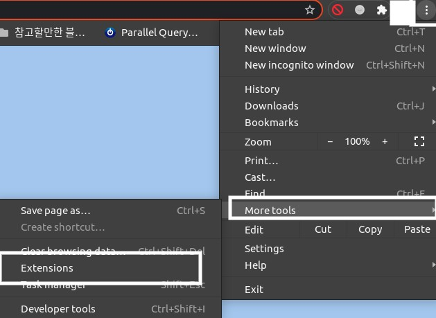
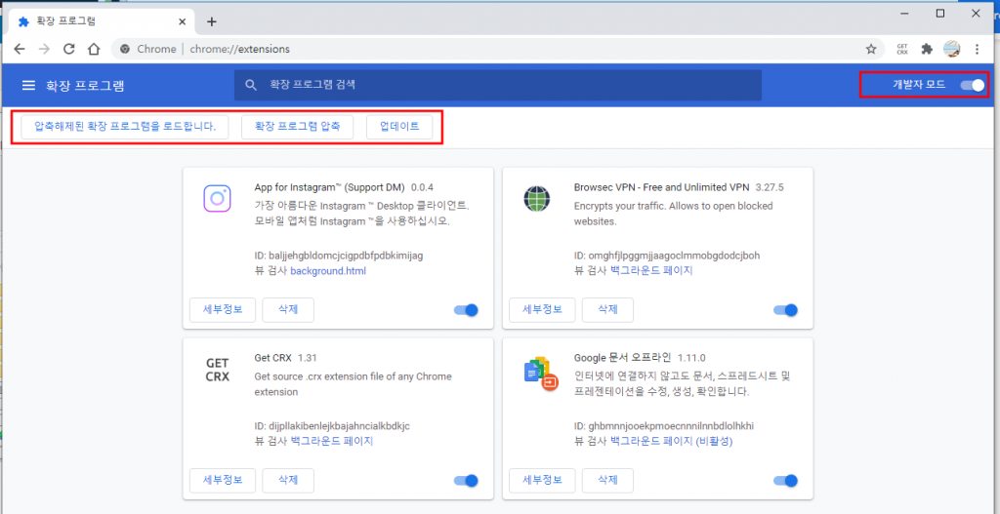
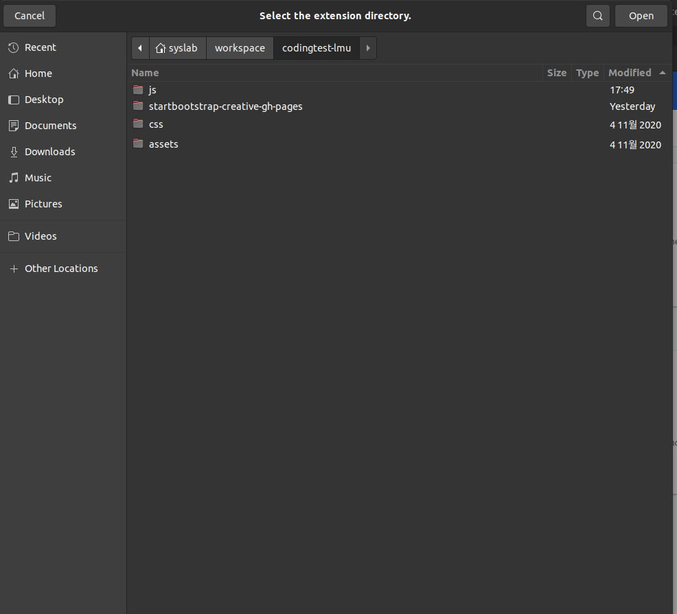

## 코딩테스트 연습용 플러그인

### 기능
 * 옵션 페이지(대회 안내 페이지)
 * 프로그래머스 상단바 제거
 * 시간초 측정
 * 문제 세트 조정

### 사용방법
 1. 크롬 익스텐션 페이지를 연다
   * 
 1. 개발자 모드를 켜고 로드를 한다.
   * 
 1. 해당 프로젝트 디렉토리를 연다.
   * 

 1. 설치된 익스텐션의 옵션페이지로 이동한다.
